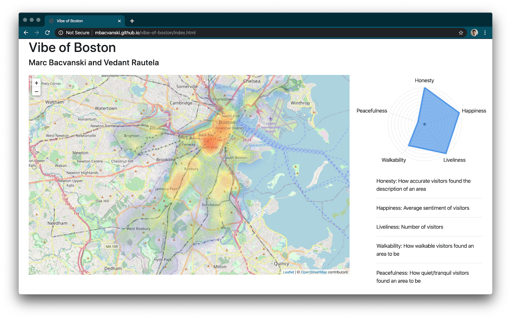
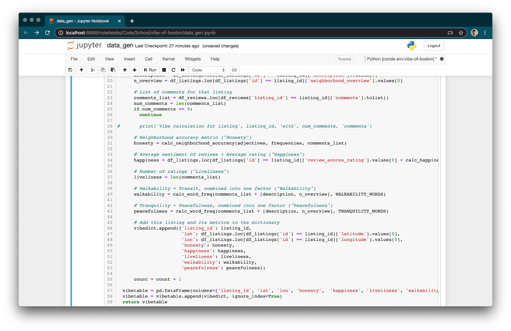
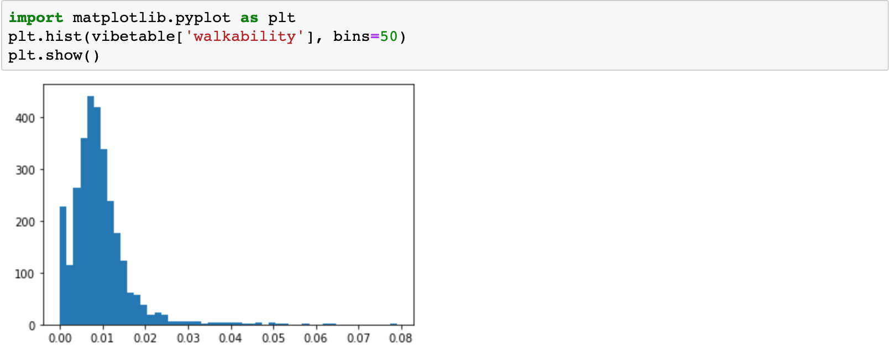
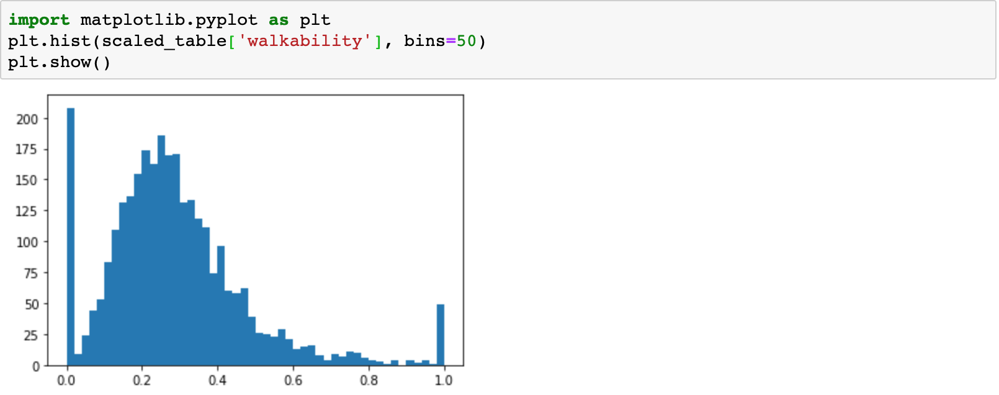

I recently worked on a [very exciting project](github.com/mbacvanski/vibe-of-boston/) with my friend Vedant Rautela.

We were inspired by the question, "Where should one stay when one visits Boston?" When we visit a new city, we don't know what to expect, but we're looking for a place to stay and explore that matches our "vibe" – our individual preferences in terms of environment, attitude, and emotional state. No single "Guide to Visiting Boston" will suffice for all of us, since our preferences are individual and unique.

19 million people visit Boston every year, with 1.3 million of those people being from overseas. While Boston is smaller than many similarly visited cities, Boston is divided into 23 official neighborhoods, each of which offers a different living experience. Boston’s set of neighborhoods mean that the city has a very diverse set of places to stay. Each neighborhood has its own personality, environment, and overall “vibe” than other neighborhoods, and people may prefer different qualities of the place they live in. We want to answer the question of where a visitor would enjoy staying, to maximize their enjoyment.

The purpose of this project is to help prospective visitors to Boston decide where to live, rent, or explore. Users of our tool will be able to uncover data-driven insights about neighborhoods based on the experiences of both those who live there, as well as those of visitors. Users will be able to use that information to find the places in Boston that most match their vibe.
# Functionality
“Vibe” is a very vague word, and in the context of analyzing the “Vibe of Boston”, we wanted to offer the user the ability to quantify and personalize this emotional response. 

The tool that we developed to help users to answer this question is an application which calculates and visualizes on a heat map, the areas of Boston which the user would likely enjoy most. 

For each listing, we calculate a “vibe vector”, composed of our calculations of a number of vibe factors. The five vibe factors that we’ve chosen to include on the heat map are _Honesty_, _Happiness_, _Liveliness_, _Walkability_, and _Peacefulness_. By no means are these a comprehensive list of all the features of Boston, but we hope that these factors will be relatively common ones that people look for in determining where to stay.
# Dataset
We performed our analysis on the [Airbnb](http://insideairbnb.com/get-the-data.html) dataset of listings, reviews, and bookings in the Boston area. We used the publicly available data from 2015 to 2020, sampled yearly. This yielded us 806,857 unique data points, of which the majority were reviews. We chose the Airbnb dataset since it includes data from both residents of Boston (who write listings) and the visitors to Boston (who write reviews). We hope that the combination of this data will yield insight into how it is to live in Boston, from a diverse and inclusive perspective that users can trust.

# Data Analysis
The application is composed of a Jupyter Notebook where data is collected and generated, and a simple HTML and JavaScript web page that visualizes the data.

We performed preliminary data analysis in Python. We manipulated data using Pandas dataframes. For preliminary natural language processing, we used the [spaCy](https://spacy.io/) library’s tokenizer and entity recognition due to its high performance and intelligent recognition of common entities. For sentiment analysis, we chose to use the [vader](https://github.com/cjhutto/vaderSentiment) library due to its ease of use and pre-trained sentiment models which worked reasonably well for our dataset. Our Jupyter notebook details our approach to cleaning, analyzing, and preparing the data for visualization. 

Natural language processing from the spaCy library was used to do in-depth analysis of the listings and review data to generate a number of metrics and ratings. For each listing, we calculated a vibe vector by computing five different vibe factors. This data is exported as a large JSON file, which is then loaded by our user-facing visualization tool.

### Honesty
Honesty is calculated by extracting the most common adjectives from the listings, and comparing them with the most common adjectives from the reviews. This is a metric of how close each listing is to the average vibe of the neighborhood it is in.
```python
import spacy
import en_core_web_sm
nlp = en_core_web_sm.load()

from vaderSentiment.vaderSentiment import SentimentIntensityAnalyzer
analyser = SentimentIntensityAnalyzer()

# Calculates the neighborhood accuracy statistic for a listing
# Neighborhood accuracy is the dot product between the neighborhood description
# and the reviews left for the place. This metric is greatest when the experience
# of the visitors most matched the vibe that was portrayed by the listing.

# Neighborhood accuracy is calculated as the sum of the number of adjectives that appear 
# in both the neighborhood description and in the reviews for a listing,
# weighted by the frequency by which those adjectives occur in all 
# neighborhood descriptions within that neighborhood.

# calc_neighborhood_accuracy(comments_list) takes in a list of strings as the comments
# for that listing. It returns a scalar neighborhood accuracy score.
def calc_neighborhood_accuracy(neighborhood_adjectives, neighborhood_frequencies, comments_list):
  neighborhood_accuracy = 0

  # Comments, excluding punctuation and special characters
  listing_comments = re.sub('[^\w\s]+', '', ' '.join(comments_list)).split()
  
  # Count up the frequencies of these words
  comment_freq = Counter(listing_comments)
  comment_words = list(comment_freq.keys())

  # Dot product time doo doo doo doo doo
  for i in range(len(neighborhood_adjectives)):
    if (neighborhood_adjectives[i] in comment_words):
      neighborhood_accuracy += neighborhood_frequencies[i] * comment_freq[neighborhood_adjectives[i]]

  neighborhood_accuracy /= len(comments_list)

  return neighborhood_accuracy
```
### Liveliness
Liveliness is the total number of reviews left by visitors to a place. This is a metric of how many people visit and are living in an area.

```python
# for each listing within this neighborhood
for listing_id in listings:
  
  description = df_listings.loc[df_listings['id'] == listing_id]['description'].values[0]
  n_overview = df_listings.loc[df_listings['id'] == listing_id]['neighborhood_overview'].values[0]
        
  # List of comments for that listing
  comments_list = df_reviews.loc[df_reviews['listing_id'] == listing_id]['comments'].tolist()
  num_comments = len(comments_list)
  if num_comments == 0:
    continue

  # Number of ratings ("Liveliness")
  liveliness = len(comments_list)
```

### Happiness
Happiness is calculated as the sum of the average rating of a listing and the average sentiment of reviews left by visitors. This is a metric of how lively and desirable an area is.

```python
# Calculates the mean sentiment of all reviews for a listing.
def calc_happiness(comments_list):  
  all_comments = '  '.join(comments_list)
  
  happiness = analyser.polarity_scores(all_comments)['compound']
  return happiness

# Average sentiment of reviews + Average rating ("Happiness")
happiness = df_listings.loc[df_listings['id'] == listing_id]['review_scores_rating'].values[0] + calc_happiness(comments_list)

```

### Walkability & Tranquility
Both of these factors are calculated with the occurrence of those related words within each of the reviews and the listing description itself. This count is normalized by dividing by the total number of words encountered in the description, neighborhood overview, and reviews to find the average walkability score of a given listing.
```python
WALKABILITY_WORDS = ["transit", "train", "subway", "T", "bus", "ride", "walk", "walking", "walkable"]
TRANQUILITY_WORDS = ["quiet", "peace", "peaceful", "pleasant", "nice"]

# Calculates the frequency of words within word list appearing in a comments list
def calc_word_freq(comments_list, word_list):
  total_count = 0
  len_total = 0
  
  # Comments, excluding punctuation and special characters
  listing_comments = re.sub('[^\w\s]+', '', ' '.join(comments_list)).split()

  comment_freq = Counter(listing_comments)
  comment_words = list(comment_freq.keys())

  for word in comment_words:
    len_total += comment_freq[word]
    if word in word_list:
      total_count += comment_freq[word]

  # Normalized by total number of words
  return total_count / len_total
```
### Vibe Factor Aggregation
```python
# Neighborhood accuracy metric ("Honesty")
honesty = calc_neighborhood_accuracy(adjectives, frequencies, comments_list)

# Average sentiment of reviews + Average rating ("Happiness")
happiness = df_listings.loc[df_listings['id'] == listing_id]['review_scores_rating'].values[0] + calc_happiness(comments_list)

# Number of ratings ("Liveliness")
liveliness = len(comments_list)

# Walkability + Transit, combined into one factor ("Walkability")
walkability = calc_word_freq(comments_list + [description, n_overview], WALKABILITY_WORDS)

# Tranquility + Peacefulness, combined into one factor ("Peacefulness")
peacefulness = calc_word_freq(comments_list + [description, n_overview], TRANQUILITY_WORDS)

# Add this listing and its metrics to the dictionary
vibedict.append({'listing_id': listing_id,
                  'lat': df_listings.loc[df_listings['id'] == listing_id]['latitude'].values[0],
                  'lon': df_listings.loc[df_listings['id'] == listing_id]['longitude'].values[0],
                  'honesty': honesty,
                  'happiness': happiness,
                  'liveliness': liveliness,
                  'walkability': walkability,
                  'peacefulness': peacefulness})
```
After calculating each of the vibe factors, we add the listing as an entry to a dictionary, which we add all at once to a Pandas dataframe for maximal efficiency.
## Normalization of Vibe Factors
Each of the vibe factors’ data points have different ranges. In order to allow the vibe alignment chart to give equal weight to each of the factors, our goal is to scale each of the factors’ data points to have values between 0 and 1.

We first examined the factors individually, to visualize their distributions. For example, here is a histogram for the distribution of walkability, before scaling. 

For example, for _Walkability_, we first subtract the 0.01’th quantile from all data points, clipping at 0. We then divide these data points by the 0.985’th quantile, clipping at 1. These quantiles took some hand tuning, but we tried to ensure that the resulting distribution looked very similar to what the data was before scaling, i.e. we were not clipping too many points above or below.
```python
import numpy as np
scaled_table = vibetable.copy()

scaled_table['walkability'] = (vibetable['walkability'] - np.quantile(vibetable['walkability'], 0.01)).clip(lower=0)
scaled_table['walkability'] = (scaled_table['walkability'] / np.quantile(scaled_table['walkability'], 0.985)).clip(upper=1)
```
Now, here is the final histogram for the distribution of walkability, after scaling. We observe how all values fall nicely between 0 and 1.

# Data Visualization
To plot the heatmap, we used the [Leaflet](https://leafletjs.com/) library atop a [OpenStreetMap](https://www.openstreetmap.org) layer. 

```javascript
const map = L.map('map').setView([42.317048, -71.077208], 11);

// Remove layers before adding our own
map.eachLayer(function (layer) {
    map.removeLayer(layer);
});

// Add attributions and map layer
L.tileLayer('http://{s}.tile.osm.org/{z}/{x}/{y}.png', {
    attribution: '&copy; <a href="http://osm.org/copyright">OpenStreetMap</a> contributors',
}).addTo(map);

// Create heatmap from formattedData, with certain parameters
const heat = L.heatLayer(formattedData, {
    max: biggestVibe,
    gradient: {0.1: 'blue', 0.2: 'green', 0.3: 'yellow', 0.4: 'orange', 1: 'red'}
}).addTo(map);
```
The interactive vibe factor alignment chart was made using [Spidergraph](https://github.com/jmstriegel/jquery.spidergraph). Changes to the weights in the vibe alignment chart cause the vibe factors to be recalculated.

```javascript
$('#spidergraphcontainer').spidergraph({
    'fields': ['Honesty', 'Happiness', 'Liveliness', 'Walkability', 'Peacefulness'],
    'gridcolor': 'rgb(172,172,172)',
    'linear': true,
});

$('#spidergraphcontainer').bind('spiderdatachange', function (ev, data) {
    processVibeTable(vibedata, {
        'honesty': data[0],
        'happiness': data[1],
        'liveliness': data[2],
        'walkability': data[3],
        'peacefulness': data[4],
    }, map);
});
```

For each point, the vibe magnitude is calculated as a weighted sum of the different vibe factors. For each weight, if the weight is decreased enough, it actually becomes negative – penalizing a listing for that vibe factor, if the user adjusts that vibe factor to be low enough. This enables the chart to have higher contrast, making it more clear which areas on the map best fit the user’s preferences.

```javascript
function calcVibe(datapoint, weights) {
    return 2 * (weights['honesty'] - (defaultWeights['honesty'] * 4.0 / 5)) * datapoint['honesty'] +
        0.5 * (weights['happiness'] - (defaultWeights['happiness'] * 4.0 / 5)) * datapoint['happiness'] +
        2 * (weights['liveliness'] - (defaultWeights['liveliness'] * 4.0 / 5)) * datapoint['liveliness'] +
        2 * (weights['walkability'] - (defaultWeights['walkability'] * 4.0 / 5)) * datapoint['walkability'] +
        2 * (weights['peacefulness'] - (defaultWeights['peacefulness'] * 1.0 / 5)) * datapoint['peacefulness'];
}
```

# Societal Value
As mentioned before, the value our tool provides is the ability users have to make informed decisions about where to live and explore in Boston. Our tool provides insights that not even native Bostonians could produce since our tool analyzes hundreds of thousands of Airbnb listings and reviews which have been written not only by Bostonians but from those outside of Boston as well. Our tool provides a custom heatmap for each individual which can allow not only visitors, but native Bostonians to learn more about their city from an outsider’s perspective. 
# Future Work
Future work on this project would include adding more vibe factors, such as culture, and allowing users to programmatically add vibe factors of their choice. Given the amount of data available from Airbnb, it would be interesting to display the change in vibe over time. Airbnb has locations all over the world, and so expanding to create a global vibe map would be exciting. Additionally, we’d like to integrate data from sources other than just Airbnb (i.e. Twitter, Reddit, etc.). These other sources would provide us a more comprehensive set of data regarding the vibe of Boston and sample certain sections of the Boston population that may be missing from the Airbnb data alone. Finally, rewriting the data processing portion using a faster language such as Golang or Rust would enable user-side vibe computation, which would open the door to extensibility and greater scale.
# Conclusion
With this project, we hope to have shed light on the intangible aspects of living in Boston, that cannot be found through reviews on Google Maps or “How to visit Boston” guides. We were able to analyze and present findings from Airbnb in a directly actionable format, guiding people’s decisions on where to stay in Boston. 

We wished to abstract over the terminology of Airbnb’s listings, and provide meaningful information about Boston itself. We hope that this tool will be useful not just to potential visitors of Boston, but to students and residents of Boston, helping them better understand the complex dynamics of a great city.

[Github Repo](https://github.com/mbacvanski/vibe-of-boston)

[Live Demo](https://mbacvanski.github.io/vibe-of-boston)
