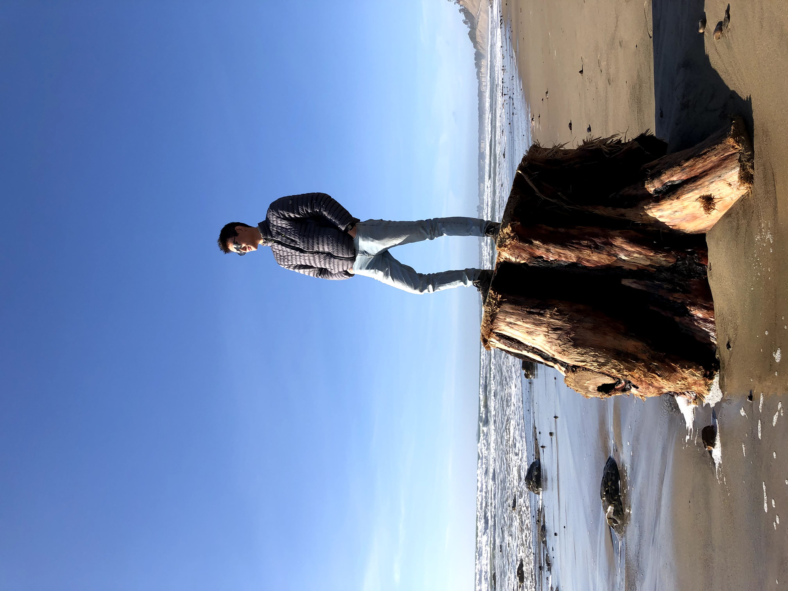

Hello!

Thanks for checking out my 2020 recap! I'm super fortunate to have done some exciting things this year, and I hope you find them interesting!

In March, I came back to the Bay Area for spring break. Midway through, I got very sick, and decided not to fly back the day I was supposed to return to Boston. Within the next few days, Northeastern cancelled in-person classes, and I never went back to Boston. My roommates and several of my friends were incredibly kind and mailed some of my belongings back, and stored the rest of my stuff with them.

I finished up the semester from home, and decided to learn to play the saxophone. I've been spending many enjoyable evenings learning jazz theory!

I became very interested in quantum computing and quantum information, so I spent time reading all I could about the subject. Some highlights from my readings were the essays at [Quantum Country](https://quantum.country/), *[Programming Quantum Computers](https://www.oreilly.com/library/view/programming-quantum-computers/9781492039679/)*, and IBM's [Qiskit Textbook](https://qiskit.org/textbook/preface.html). Some of these readings gave me vague warm fuzzy feelings about quantum computing, but many just left me more confused than I started. Other readings like [Nielsen and Chuang](http://mmrc.amss.cas.cn/tlb/201702/W020170224608149940643.pdf)'s textbook lost me in complex math and physics. I was determined to truly understand it.

In the meantime I began taking Summer 1 classes: Object Oriented Design, and Sex in Christianity, Judaism, and Islam.

After Summer 1 classes ended, I registered for [UC BerkeleyX's CS191x](https://www.edx.org/course/quantum-mechanics-and-quantum-computation), Quantum Mechanics and Quantum Computation. I knew the basics of the gate model of quantum computing, but I loved the rigorous mathematical approach the course took. Eschewing hand-wavey analogies and generalizations, I learned to understand the math and physics underpinnings behind quantum information processing. Over the 10 weeks of the course, I learned foundational algorithms like Shor's factoring, Grover's search, the Quantum Fourier Transform, and others. The final few weeks were devoted to quantum mechanics, including particles in square wells and wavefunctions. It was very challenging for me, but I am proud to have passed the exams and received a certificate for this course.

I was then selected to participate in IBM's [Qiskit Summer School](https://qiskit.org/events/summer-school/), a program for students to dive deep into Qiskit, IBM's quantum computing software framework. I found a great online community with the other students in the program, and worked on projects including error correction and hamiltonian simulation.

In the final weeks of summer break, I enrolled in and completed a five-course [specialization in Deep Learning](https://www.coursera.org/specializations/deep-learning). These courses covered neural networks, architectures, and deep learning from first principles. I absolutely love linear algebra, and the mathematics in these courses gave me a reason to review it. After covering first principles, the course moved into best practices (transfer learning, hyperparameter tuning), and then focused on architectures including CNNs, RNNs, and sequence models. I built cool things like image segmentation and detection using YOLOv3, and recurrent neural networks to improvize jazz music. I received certifications for all five courses, as well as for the specialization as a whole. 

Fall semester started off in a haze of wildfire smoke in California, during which I built an outdoor air quality monitoring station using the [OEM particulate matter sensors](http://www.plantower.com/en/content/?109.html) used by [PurpleAir](https://www.purpleair.com/map?mylocation) sensors. I connected a \$10 Raspberry Pi Zero (how do they make them this cheap??) to the sensor and [wrote a script](https://gist.github.com/mbacvanski/8d255433fe25adb431e310a687719ddb) to calculate the AQI index of the air outside. Instead of buying the [\$280 sensor from PurpleAir](https://www2.purpleair.com/collections/air-quality-sensors), the total cost of this was around \$35. On a record day I saw an AQI of 625, confirmed by PurpleAir's network. There was a hill half a mile away from my house, and I wasn't even able to see that!

Around August, the loneliness and isolation of staying at home really started to get to me. To give my days some structure and meaning, **I started keeping a log of the things I learned every day. [Look at it here!](/learning)**

I decided not to return to Boston in the fall, and instead opted to take classes remotely from home. This semester was one of the busiest I've ever had, but staying at home fortunately gave me the time I needed to focus on my studies (i.e. not going to parties). The most challenging aspect was maintaining a disciplined schedule when my classes were asynchronous and there was little structure to my days. I genuinely loved all the classes I took, and learned so much:

* CS3650: Computer Systems, a course on programming on Linux systems using Assembly and C. Some projects that I loved were writing a Unix shell using `fork` and `exec`, designing and implementing a memory allocator faster than `malloc`, and designing and implementing a file system using the `fuse` interface.
* [JRNL 3650: Science Journalism](https://web.northeastern.edu/nuscicomm/category/blogposts/), where I learned and applied skills in science reporting and journalism. I really enjoyed writing [this piece](/blog/ventilating-classrooms-covid) about the effect of ventilation systems on COVID spread, for which I interviewed several fluid dynamics researchers at Cambridge. Some of the writings I did for this course I've also published on my [blog](/blog).
* EECE2160: Embedded Design for Robotics was a fun introduction to the world of embedded programming using C++ and Verilog. I'm a sucker for switches, hardware, and flashing LEDs, so I enjoyed the projects.
* CS3000: Algorithms and Data Structures, for which you can find my notes [here](/blog/cs3000).

This year I took on a role as a venture analyst at [Northeastern's IDEA venture accelerator](https://www.northeastern.edu/idea/), which was an incredibly fun and rewarding experience. I loved working closely with startup founders, learning about their stories, and mentoring their ventures.

Looking forward, I'm starting a [quantum computing club at Northeastern](https://www.neuqc.org), where I hope to share my excitement for this field with others and learn together. Starting in January 2021, I'm excited to be working as a software co-op at [Vicarious Surgical](https://www.vicarioussurgical.com/).

I have so much to be grateful for in 2020 – my family, mentors, friends, and all who have been part of my life. I look forward to everything that 2021 will bring.

 

– Marc

