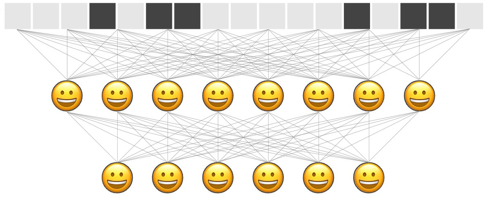

Traditional feedforward neural networks were first discovered in the 1940s as a combination of single perceptrons, and they achieved greater success as increases in computational power enabled ever larger networks to be trained. Training feedforward neural networks typically relies on backpropagation, where for each layer of the network, the weights are updated according to a gradient that is computed with respect to the layer's input.

A single layer of a feedforward neural network computes the product between its inputs and its weights to produce an intermediate result, $h=w^Tx$. This intermediate result is passed through a nonlinear function $f$, such as a sigmoid function, so that a layer's output is $a=f(h)$. To train a feedforward neural network, we first compute the forward pass through all the layers of the input data, by computing both $h$ and $a$, and storing $\frac{\partial h}{\partial x}$. Then, a loss function tells us how far off our network's prediction was from the input. To update the weights of layer $i$ and actually "learn", we perform a backwards pass by moving backwards from the last layer to the first layer, computing the gradient of layer $i$'s prediction with respect to layer $i-1$'s activation, which was that layer's input. This means we compute the derivative of the layer's output $a$, with respect to the layer's input $x$, as $\frac{\partial a}{\partial x}=\frac{\partial a}{\partial h}\cdot\frac{\partial h}{\partial x}$. This is possible because on the forward pass, we computed and stored the value of $\frac{\partial h}{\partial x}$. This approach, called backprop, is used in almost all modern neural networks.

Neural networks originated from mimicking the structure of the human brain, where neurons transmit information to each other via electrical impulses akin to activations. However, backpropagation doesn't seem like an elegant solution that nature would come up with for learning — backprop relies on storing information from the forward pass to be used in the backwards pass, and requires propagating error derivatives backwards during learning. There isn't much biological evidence for neurons storing information from the forward pass, nor for neurons passing information backwards during learning. Could we train neural networks in a different way?

## Positive and Negative Data

Traditional neural networks are trained by providing the network with an input x and a desired output y. The network is given x as input, and at the end, the network's prediction is compared to the ground truth value of y using a loss function. This loss function tells the network how far off it was from predicting the ground truth value, and taking the derivative of this function with respect to x provides a way to update the network's weights according to gradient descent.

Forward-forward networks have to rely on a different approach since they want to avoid computing a loss function for the entire network. The core idea of the forward-forward network is to train each layer individually so that each layer responds most "positively" to positive data and most "negatively" to negative data. This means we want our network's layers to produce a high activation when it sees positive data, and a low activation about negative data. Utilizing positive and negative data may not seem intuitive at first, but by demonstrating to the network good and bad inputs, our network will be able to update its weights and learn without computing global derivatives. Because we can't tell our network after the end of a forward pass how close it was to the ground truth value, we must incorporate both $x$ and $y$ into good and bad data. We can say good data is data where the label $y$ matches the input $x$, and bad data is data where the label $y$ does not match the input $x$. By providing both good and bad data with the same $x$'s, the network can compute derivatives on the basis of recognizing correct labelings of $y$ from incorrect labelings of $y$.


([Source](https://twitter.com/martin_gorner/status/1599762227263074304/photo/1))

Forward-Forward doesn't require storing information during the forward pass, nor propagating gradients from one layer to another. Moreover, it is far more biologically plausible than backpropagation since it doesn't require interrupting to propagate error derivatives.

Here, I'll walk you through a simple implementation of the forward-forward algorithm to train a neural network to classify MNIST handwritten digits. See all the [source code here]([forward-forward-mnist-with-explanations.ipynb · GitHub](https://gist.github.com/mbacvanski/07526e86dee5bf6ba2d09e55e4a14902)), where you can also open it in Google Colab.

## Utilities

Since the forward-forward network expects inputs to contain both the data $x$ as well as the label $y$ together, we concatenate the data and label together. Note that there are 10 possible output classes.

```python
def combine_x_y(x, y):
    x_ = x.clone()
    label_onehot = torch.nn.functional.one_hot(y, 10) * x.max()
    return torch.hstack([x, label_onehot])
```

## A single layer

Let's define a single layer first. We'll inherit from a linear layer, since the output is computed as the activation function applied to the intermediate multiplication of input and weights, $a=f(h)$ where $h=w^Tx$. 

```python
class Layer(torch.nn.Linear):
    def __init__(self, in_features, out_features, bias=True, device=None, dtype=None):
        super().__init__(in_features, out_features, bias, device, dtype)

        # define the components we will use
        self.activation = torch.nn.ReLU()
        self.optimizer = torch.optim.Adam(self.parameters(), lr=0.03)

        # define hyperparameters
        self.num_epochs = 1000

        # keep track of losses during training
        self.losses = []
```

Here we define the forward pass through this layer. This is the same as how a linear layer does it, taking the matrix multiplication of $x^T$ and the weights and adding the bias term. The difference is that here we first normalize the input to the layer, so we first take only the unit vector of the input. Remember that because the previous layer will output a vector of differing magnitude depending on how "excited" it is about its input, taking the norm of the vector guarantees that only the direction of the output from the previous layer is used to determine how excited this layer is about, the input.

```python
def forward(self, x):
    x_normalized = x / (x.norm(2, 1, keepdim=True) + 1e-8)
    # w^T + b
    return self.activation(
        torch.mm(x_normalized, self.weight.T) + self.bias.unsqueeze(0)
    )
```

Each layer of the forward-forward network can train itself, because it does not rely on gradients from other layers in the network. All it needs is a source of positive and negative data. There are several ways we could define a "positive" response versus a "negative" response, but the simplest approach could be just the L2 norm (magnitude) of the vector outputted by the layer. The first layer of the network receives data as the concatenation of X and Y (data and label), while subsequent layers receive the output of the previous layer's forward pass on the positive and negative data for X and Y, respectively. 

```python
    def train(self, x_positive, x_negative):
        self.losses = []
        for i in range(self.num_epochs):
            goodness_positive = self.forward(x_positive).pow(2).mean(1)
            goodness_negative = self.forward(x_negative).pow(2).mean(1)
```

We define our loss function so that if we were to minimize it, we would end up having to maximize the goodness of `x_positive`, and minimize the goodness of `x_negative`. This cost function provides the surface for which we find the gradient to minimize. 

```python
            loss = torch.log(1 + torch.exp(torch.cat([-goodness_positive + self.threshold,
                                                      goodness_negative - self.threshold]))).mean()
```

Notice that even though we compute a gradient, this gradient is only local — it is computed solely from information in this layer, and is not passed to another layer, unlike in backprop. 

```python
            self.optimizer.zero_grad()
            loss.backward()
            self.optimizer.step()

            self.losses.append(loss.item())
```

Finally, the goodnesses of the positive data and the negative data computed in this layer's forward pass is needed to train the next layer.

```python
        return self.forward(x_positive).detach(), self.forward(x_negative).detach()
```

## A Network

Now that we've defined a single layer, let's combine a few of them into a multi-layer network. We'll build our network by adding layers, each with the input dimensions of the previous layer, and the output dimensions of the next layer. The first dimension is the dimension of our input data.

```python
class FFNN(torch.nn.Module):
    def __init__(self, dims):
        super().__init__()
        self.layers: List[Layer] = []

        for d in range(len(dims) - 1):
            self.layers.append(Layer(dims[d], dims[d+1]).cuda())
```

To train our network, all we do is ask each layer to train itself. Notice how this only requires one pass through the layers, and the only data shared is the forward pass result of each layer.

```python
    def train(self, x_positive, x_negative):
        h_positive, h_negative = x_positive, x_negative
        for i, layer in enumerate(self.layers):
            print('Training layer', i)
            h_positive, h_negative = layer.train(h_positive, h_negative)
```

To predict which class an image $x$ belongs to, we can present our network with the input $x$ concatenated with each possible class, and see which label appended to the image is the network most excited about by computing the forward pass. Specifically, we compare the total activation across all layers of the entire network. 

```python
    def predict(self, x):
        goodness_per_label = []
        for label in range(10):
```

First, we generate an array of just that label, and append it to all $x$.

```python
            label_arr = [label] * x.shape[0]
            input = combine_x_y(x, torch.tensor(label_arr).cuda())
```

Then, we pass this input through the network and record the sum activation across all the layers.

```python
            goodnesses_per_layer = self._forward_pass(input)
            goodness_per_label.append(sum(goodnesses_per_layer).unsqueeze(1))
```

The class that the network predicts is the class of data that achieves the highest total activation. With $x$ remaining constant, the only differences in the activations comes from the label appended to $x$.

```python
        goodness_per_label = torch.cat(goodness_per_label, 1)
        return goodness_per_label.argmax(1)
```

To compute the forward pass, we record the magnitude of the activations of each of the layers, passing each layer's activation to the subsequent layer.

```python
    def _forward_pass(self, input):
        h = input
        goodnesses = []
        for layer in self.layers:
            """ Goodness is computed as the magnitude of the activations of this layer """
            activation = layer(h)
            activation_magnitude = activation.pow(2).mean(1)
            goodnesses.append(activation_magnitude)

            """ Use the activation of this layer as the input to the next layer """
            h = activation

        return goodnesses
```

## Training

```python
def MNIST_loaders(train_batch_size=50000, test_batch_size=10000):

    transform = Compose([
        ToTensor(),
        Normalize((0.1307,), (0.3081,)),
        Lambda(lambda x: torch.flatten(x))])

    train_loader = DataLoader(
        MNIST('./data/', train=True, download=True, transform=transform),
        batch_size=train_batch_size, shuffle=True)

    test_loader = DataLoader(
        MNIST('./data/', train=False, download=True, transform=transform),
        batch_size=test_batch_size, shuffle=False)

    return train_loader, test_loader


torch.manual_seed(42)
train_loader, test_loader = MNIST_loaders()
```

To create our positive data, we combine images and their correct labels.

```python
x, y = next(iter(train_loader))
x, y = x.cuda(), y.cuda()

x_positive = combine_x_y(x, y)
```

To create negative data, we can combine our images with random labels.

```python
rnd = torch.randperm(y.size(0))
x_negative = combine_x_y(x, y[rnd])
```

Let's make a network with 2 layers of 500 neurons each, and train it.

```python
input_dimension = x_positive[0].size(0)
network = FFNN([input_dimension, 500, 500])
network.train(x_positive, x_negative)
print('Training error:', 1.0 - network.predict(x).eq(y).float().mean().item())

x_test, y_test = next(iter(test_loader))
x_test, y_test = x_test.cuda(), y_test.cuda()
print('Test error:', 1.0 - network.predict(x_test).eq(y_test).float().mean().item())
```

After training with 1000 epochs on each layer, this network receives a training error of approximately 0.0715 on the training dataset, and 0.0709 on the test dataset. Plotting losses shows loss for both layers decreases nicely over training!

![](data:image/png;base64,iVBORw0KGgoAAAANSUhEUgAAAYIAAAEWCAYAAABrDZDcAAAABHNCSVQICAgIfAhkiAAAAAlwSFlzAAALEgAACxIB0t1+/AAAADh0RVh0U29mdHdhcmUAbWF0cGxvdGxpYiB2ZXJzaW9uMy4yLjIsIGh0dHA6Ly9tYXRwbG90bGliLm9yZy+WH4yJAAAgAElEQVR4nO3deXxddZ3/8dc7S5u2Wbql+w4t0CJlKZsgVAedwk9ZXEHFcUWHgXEZxsHHzE8dHJ1xxg0HUFEBxRHGQYUO8rPKImWXgKXSQveWplvSPemaJp/fH+ek3CZpmy63N8l5Px+P+8g9y733c3oh73y/33O+RxGBmZllV1GhCzAzs8JyEJiZZZyDwMws4xwEZmYZ5yAwM8s4B4GZWcY5CMwKTFJIOr7QdVh2OQisW5O0XNJFha6jLUnvl7RC0jZJ90saWOiazPbHQWB2BCSVdLBuCvAD4GpgKLAduO0Yl2bWaQ4C65EkDZD0oKR6SZvS56PSbe+R9EKb/T8n6YH0eW9J35D0mqR1kr4vqU+6bbqkWkn/IGktcGcHH/8B4H8jYnZENAL/F3inpIpO1F0l6adp3Ssk/ZOkonTb8ZIel7RF0npJ/52ul6RvS6qTtFXSnyWdfAT/fJYxDgLrqYpIfkmPBcYAO4Bb0m0zgfGSTsrZ/2rgp+nzfwMmAacCxwMjgS/m7DsMGJi+9zUdfPYU4KXWhYhYAuxO3/Ng/hOoAiYAFwIfAj6SbvsK8DtgADAq3RfgbcAF6ftXAe8FNnTis8wAB4H1UBGxISJ+GRHbI6IB+CrJL1YiYhfw38AHYW9XzjjgQUki+eX+2YjYmL72a8CVOW/fAnwpInZFxI4OPr4c2NJm3RbggC0CScXp53whIhoiYjnwTZKQAmgiCZ8REbEzIp7MWV8BnAgoIl6JiDUH+iyzXA4C65Ek9ZX0g7R7ZSswG+if/rIF+Anw/vQX/9XAL9KAqAb6Ai9I2ixpM/DbdH2r+ojYeYCPbwQq26yrBBoOUvZgoBRYkbNuBUmLBODzgIA/Spon6aMAEfEoSWvnVqBO0u2S2n6+2X45CKyn+jvgBODsiKgk6TqB5BcpEfEsSXfNm4D3A3en29eTdCNNiYj+6aMqIspz3vtgU/bOA6a2LkiaAPQGFh7kdet5/a/+VmOAVWnNayPiExExAvgkcFvraacR8d2IOAOYTNJF9PcH+SyzvRwE1hOUSirLeZSQdJXsADanp25+qYPX/ZTkL+mm1m6WiGgBfgh8W9IQAEkjJf3lIdTzX8A7JL1JUj/gJuBXaTfTfkVEM/AL4KuSKiSNBT4H/Cyt4z2tA97AJpJAapF0pqSzJZUC24CdJN1XZp3iILCe4CGSX/qtjy8D3wH6kPyV/SxJ905bdwMnk/6izfEPwGLg2bRb6WGS1kWnRMQ84FMkgVBHEkrXdvLl15P8Ml8KPAn8HLgj3XYm8JykRpIB709HxFKSbqcfkoTDCpKB4v/obL1m8o1pLKvSU0LrgNMjYlGh6zErFLcILMv+GnjeIWBZ1+6qSLMskLScZOD48gKXYlZw7hoyM8s4dw2ZmWVct+saGjx4cIwbN67QZZiZdSsvvPDC+oio7mhbtwuCcePGUVNTU+gyzMy6FUkr9rfNXUNmZhnnIDAzyzgHgZlZxjkIzMwyzkFgZpZxDgIzs4xzEJiZZVxmgmDB2ga++bsFrG/cVehSzMy6lMwEwZL6Rv7z0cUOAjOzNjITBKXFyaHuafYke2ZmuTIUBAJgd7Pv4GdmliszQdArbRE07XEQmJnlylsQSLpDUp2kl/ez/URJz0jaJemGfNXRqrQkDQJ3DZmZ7SOfLYK7gBkH2L4R+FvgG3msYa/WMYImdw2Zme0jb0EQEbNJftnvb3tdRDwPNOWrhlweIzAz61i3GCOQdI2kGkk19fX1h/UevdwiMDPrULcIgoi4PSKmRcS06uoOb7BzUO4aMjPrWLcIgqOhJO0aatrjwWIzs1yZCYLWriGPEZiZ7Stv9yyWdA8wHRgsqRb4ElAKEBHflzQMqAEqgRZJnwEmR8TWfNTjriEzs47lLQgi4qqDbF8LjMrX57fVeh2Bp5gwM9tXZrqGSop8+qiZWUcyEwTFaRC0tLhFYGaWKztBoDQInANmZvvITBCkOUBzOAnMzHJlKAhEkdw1ZGbWVmaCAJJxgha3CMzM9pGpIJDkriEzszYyFQTFkruGzMzayFYQFMlnDZmZtZGpIJCg2UlgZraPTAWBB4vNzNrLVhDIQWBm1lamgkASnmrIzGxfmQqC4iJfUGZm1la2gsBdQ2Zm7WQqCHxBmZlZe5kKguIiX1BmZtZW3oJA0h2S6iS9vJ/tkvRdSYslzZV0er5qaeULyszM2stni+AuYMYBtl8MTEwf1wDfy2MtQHpBmbuGzMz2kbcgiIjZwMYD7HIZ8NNIPAv0lzQ8X/WA5xoyM+tIIccIRgIrc5Zr03XtSLpGUo2kmvr6+sP+QF9ZbGbWXrcYLI6I2yNiWkRMq66uPuz38QVlZmbtFTIIVgGjc5ZHpevyprgItwjMzNooZBDMBD6Unj10DrAlItbk8wN9QZmZWXsl+XpjSfcA04HBkmqBLwGlABHxfeAh4BJgMbAd+Ei+asmpydNQm5m1kbcgiIirDrI9gL/J1+d3xIPFZmbtdYvB4qOlSNDiwWIzs31kLAg815CZWVuZCoLiIhEOAjOzfWQqCIo8WGxm1k62gsCTzpmZtZOtIBDuGjIzayNjQeAWgZlZW5kKAuEpJszM2spWEEg4B8zM9pWpICiSWwRmZm1lLAjcIjAzaytbQeBpqM3M2slUEMjTUJuZtZOpIHDXkJlZexkLAncNmZm1lakgSK4jKHQVZmZdS6aCoEgicBKYmeXKaxBImiFpgaTFkm7sYPtYSY9ImivpD5JG5bke35jGzKyNvAWBpGLgVuBiYDJwlaTJbXb7BvDTiDgFuAn413zVA550zsysI/lsEZwFLI6IpRGxG7gXuKzNPpOBR9Pnj3Ww/ajypHNmZu3lMwhGAitzlmvTdbleAt6ZPr8CqJA0qO0bSbpGUo2kmvr6+sMuyBeUmZm1V+jB4huACyX9CbgQWAU0t90pIm6PiGkRMa26uvqwP0xuEZiZtVOSx/deBYzOWR6VrtsrIlaTtggklQPviojN+SrIYwRmZu3ls0XwPDBR0nhJvYArgZm5O0gaLKm1hi8Ad+SxHoSnmDAzaytvQRARe4DrgFnAK8AvImKepJskXZruNh1YIGkhMBT4ar7qgdYri/P5CWZm3U8+u4aIiIeAh9qs+2LO8/uA+/JZQ67kxjROAjOzXIUeLD6mPOmcmVl7GQsCnz5qZtZWtoKgyKePmpm1lakgkFsEZmbtZCoIPEZgZtZexoLALQIzs7YyFQS+oMzMrL1MBUGR8G1pzMzayFQQKB0j2LRtd6FLMTPrMjIVBEUSAKd95fcFrsTMrOvIWBAUugIzs64nW0HgJDAzaydTQaCcHPDkc2ZmiUwFQVFOEniqCTOzRKaCILdjaE9LS8HqMDPrSjIVBPu0CJwDZmZAnoNA0gxJCyQtlnRjB9vHSHpM0p8kzZV0SX7ref25WwRmZom8BYGkYuBW4GJgMnCVpMltdvsnkltYnkZyT+Pb8lUP7NsiaPYggZkZkN8WwVnA4ohYGhG7gXuBy9rsE0Bl+rwKWJ3Heva5jmCPg8DMDMhvEIwEVuYs16brcn0Z+KCkWpJ7G1/f0RtJukZSjaSa+vr6wy4o9zoCtwjMzBKFHiy+CrgrIkYBlwB3S2pXU0TcHhHTImJadXX1YX9YsYPAzKydfAbBKmB0zvKodF2ujwG/AIiIZ4AyYHC+CipxEJiZtZPPIHgemChpvKReJIPBM9vs8xrwFwCSTiIJgsPv+zmI4qLXD9djBGZmibwFQUTsAa4DZgGvkJwdNE/STZIuTXf7O+ATkl4C7gE+HHmc+6E452ibffqomRkAJfl884h4iGQQOHfdF3OezwfOy2cNudwiMDNrr9CDxceUxwjMzNrrVBBI6td6No+kSZIulVSa39KOvtyzhhp37nEYmJnR+RbBbKBM0kjgd8DVwF35KipfclsE77v9Wf7p/pcLWI2ZWdfQ2SBQRGwH3gncFhHvAabkr6z8aHtjmnv++FqBKjEz6zo6HQSSzgU+APwmXVecn5Lyx/cnMzNrr7NB8BngC8Cv01NAJwCP5a+s/JAcBWZmbXXq9NGIeBx4HCAdNF4fEX+bz8LywTFgZtZeZ88a+rmkSkn9gJeB+ZL+Pr+lHX1FbhGYmbXT2a6hyRGxFbgc+H/AeJIzh7qVjnLAN7E3s6zrbBCUptcNXA7MjIgmknsJdCsdBcGOpuZjX4iZWRfS2SD4AbAc6AfMljQW2JqvovJFHYwSbNvlIDCzbOtUEETEdyNiZERcEokVwJvzXNsxcfezK1i3dWehyzAzK5jODhZXSfpW613CJH2TpHXQrRR10DX03UcW8eE7nz/2xZiZdRGd7Rq6A2gA3ps+tgJ35quofNnfdQQL1zUc40rMzLqOzk5DfVxEvCtn+Z8lzclHQflU1afbzZNnZpZ3nW0R7JB0fuuCpPOAHfkpKX9OGFbBnR8+s8Nts+atZfP23ce4IjOzwutsEHwKuFXScknLgVuAT+atqjx684lD2q1rbgk+efcL3PzIogJUZGZWWJ09a+iliJgKnAKcEhGnAW852OskzZC0QNJiSTd2sP3bkuakj4WSNh/yERymIRW9262bt7rbnRFrZnbEdLhX1kp6LSLGHGB7MbAQeCtQS3Iz+6vS21N2tP/1wGkR8dEDfe60adOipqbmsGputXbLTsrLSjj5S7PabRtRVcYtHzid08cMOKLPMDPrSiS9EBHTOtp2JLeqPNjEPWcBiyNiaUTsBu4FLjvA/leR3MA+74ZVlVHeu+Nx8tVbdnLDL17iW79bwK49vtjMzHq+fLYI3g3MiIiPp8tXA2dHxHUd7DsWeBYYFRHtfvtKuga4BmDMmDFnrFix4rBqbmvz9t3saQlufngRowb04V//36vt9rns1BFcOnUEp47uz6Dy9t1JZmbdwYFaBAc8fVRSAx3PKSSgz1GordWVwH0dhQBARNwO3A5J19DR+tD+fXsB8JXLT6alJdi9p4XjhpTz+fvmMrSyN0vqt/HAnNU8MGc1ANUVvTl9TBIIk4aUM3ZwP04aVsnQyt6+14GZdVsHDIKIqDiC914FjM5ZHpWu68iVwN8cwWcdsaIicf1fTATg4pOHsaclWLlxO7WbdrB68w7mrtpC3dZdLKpr5OnFG2jYtWfvayvLSjhj7ADOmTCIc48bxJQRVRR3dBmzmVkX1NkLyg7H88BESeNJAuBK4P1td5J0IjAAeCaPtRwSSZQWiwnV5UyoLgeS4ls1twQbt+1mSX0jC9c18Mqarfxx2UYeW1APQEXvEs6eMJBL3jCcv5wyjH77GY8wM+sK8vYbKiL2SLoOmEVyf+M70ttc3gTURMTMdNcrgXujG90YoLhIVFf0prqiN+dMGLR3fd3WnTyzdAPPLt3I7IX1PPxKHX17vczFJw/nY+ePZ/KIygJWbWbWscMeLC6Uo3H66LHQ0hLUrNjEr/9Uy8w5q9m2u5k3TRzMZy6axBljfWqqmR1bBxosdhAcA1u2N/Gz51Zw51PLWd+4i/9zynBunHEiowf2LXRpZpYRDoIuYtuuPfxg9lJun72ECLjhbSfw0fPHe2DZzPIuXxeU2SHq17uEz711Eo/dMJ03TRzMVx96hXd+72kWeRpsMysgB0EBDK/qww8/NI2brzyV1zZs4x23PMkvalbS3VpnZtYzOAgKRBKXnTqSWZ+5gNNGD+Dz983l737xEttyrk8wMzsWHAQFNqSyjJ99/Gw+e9Ek7p+ziktveZLFdY2FLsvMMsRB0AUUF4lPXzSRn338bDZvb+LyW5/i4fnrCl2WmWWEg6ALeeNxg/nf689n/OB+fPynNXz3kUW0tHjcwMzyy0HQxYzo34f/+dS5vPO0kXzr9wv51M9eoNHjBmaWRw6CLqistJhvvncqX3z7ZB55tY4rbn2KZeu3FbosM+uhHARdlCQ+ev547v7oWaxv3MWltzzJI6943MDMjj4HQRf3xuMHM/O68xkzsC8f+0kN33l4occNzOyochB0A6MH9uWXf/1G3nnaSL7z8CI+8dMatuxoKnRZZtZDOAi6idZxg3++dAqPL6zn8lufYsFaT01hZkfOQdCNSOKv3jiOe645h8Zde7jitqd4cO7qQpdlZt2cg6AbOnPcQB68/nxOGl7JdT//E1976BX2NLcUuiwz66YcBN3U0Moy7vnEOXzwnDHcPnspH/zxc9Rt3VnossysG8prEEiaIWmBpMWSbtzPPu+VNF/SPEk/z2c9PU2vkiL+5fI38I33TOWllVu45LtP8MSi+kKXZWbdTN6CQFIxcCtwMTAZuErS5Db7TAS+AJwXEVOAz+Srnp7s3WeMYuZ15zGwXy8+dMcf+casBe4qMrNOy2eL4CxgcUQsjYjdwL3AZW32+QRwa0RsAoiIujzW06NNHFrBA39zPu89YzS3PLaY9//wOdZs2VHossysG8hnEIwEVuYs16brck0CJkl6StKzkmZ09EaSrpFUI6mmvt5dH/vTp1cxX3/3KXznfafy8uotXHLzEzy2wNlqZgdW6MHiEmAiMB24CvihpP5td4qI2yNiWkRMq66uPsYldj+XnzaSB68/n2FVffjInc/z5Znz2NnUXOiyzKyLymcQrAJG5yyPStflqgVmRkRTRCwDFpIEgx2hCdXl/PraN/KR88Zx19PLeft/PsnLq7YUuiwz64LyGQTPAxMljZfUC7gSmNlmn/tJWgNIGkzSVbQ0jzVlSllpMV96xxTu/thZNOxs4orbnuLWxxbT7LmKzCxH3oIgIvYA1wGzgFeAX0TEPEk3Sbo03W0WsEHSfOAx4O8jYkO+asqqN02sZtZnLuBtU4bxH7MWcOXtz7By4/ZCl2VmXYQiutdfh9OmTYuamppCl9EtRQT3z1nFF++fR3MEN158Ih88eyxFRSp0aWaWZ5JeiIhpHW0r9GCxHUOSuOK0Ufz2sxcwbdxAvvjAPN53+zMsrW8sdGlmVkAOggwa2b8PP/nImXzjPVNZuK6RGTc/wff+sMQXoZlllIMgoyTx7jNG8fvPXcBbThjC13/7Klfc9jTzV28tdGlmdow5CDJuSEUZ37/6DG77wOms2bKDd9zyJDf973wadvrGN2ZZ4SAwAC55w3Ae+dx0rjprNHc+vYy/+ObjPDBnFd3tZAIzO3QOAturqm8p/3L5G7j/2vMYVlXGp++dwwd+9ByL63wnNLOezEFg7Uwd3Z9fX3se/3L5yby8agsX3/wEX/3NfN8n2ayHchBYh4qLxAfPGcujN0znitNG8qMnlzH9Px7jp88sp8lnF5n1KA4CO6DB5b3593dP5cHrz+fEYZV88YF5zPjObB59dZ3HD8x6CAeBdcqUEVX8/BNn86MPTSMCPnpXDR/88XPMrd1c6NLM7Ag5CKzTJHHR5KHM+uwFfPkdk5m/eiuX3vIUn7y7hoXrPKBs1l15riE7bA07m/jxk8v40RPL2LZ7D5dNHcFnLprEuMH9Cl2ambVxoLmGHAR2xDZt2833Zy/hJ08vp6k5eO+0UVw7/XhGD+xb6NLMLOUgsGOirmEntz22hJ8/9xrNEVx26giunX4cxw+pKHRpZpnnILBjas2WHfxw9jJ+/scV7NrTwowpw7h2+vG8YVRVoUszyywHgRXEhsZd3PnUcn7yzHIadu7hgknVfOqCCZx73CAk3wPB7FhyEFhBbd3ZxM+eXcGPn1jGhm27OXFYBR89fzyXTh1BWWlxocszy4SC3ZhG0gxJCyQtlnRjB9s/LKle0pz08fF81mOFUVlWyrXTj+epG9/Cv7/rFCLg8/fN5fyvP8p3Hl5IfcOuQpdolml5axFIKgYWAm8FakluZn9VRMzP2efDwLSIuK6z7+sWQfcXETy1eAN3PLWMR1+to1dxEe+YOoIPnDOG00b3d7eRWR4cqEVQksfPPQtYHBFL0yLuBS4D5h/wVdbjSeL8iYM5f+JgltQ3ctdTy/nVi7X88sVaThxWwQfOHsPlp42koqy00KWaZUI+u4ZGAitzlmvTdW29S9JcSfdJGt3RG0m6RlKNpJr6+vp81GoFclx1OV+5/GSe+8eL+NoVb6C4SPzfB+Zx9tce4cZfzvUUFmbHQD67ht4NzIiIj6fLVwNn53YDSRoENEbELkmfBN4XEW850Pu6a6hniwjm1m7h58+9xsyXVrOjqZmThlfyrtNHctmpI6mu6F3oEs26pYKcNSTpXODLEfGX6fIXACLiX/ezfzGwMSIOeLK5gyA7tu5s4oE/reK+F1fx0srNFBeJCydV887TR3LRSUN9xpHZISjUGMHzwERJ44FVwJXA+9sUNjwi1qSLlwKv5LEe62Yqy0q5+txxXH3uOBbXNfDLF1fx6xdX8eirdVSUlfD2U0Zw+akjOHPcQIqKPMBsdrjyeh2BpEuA7wDFwB0R8VVJNwE1ETFT0r+SBMAeYCPw1xHx6oHe0y2CbGtuCZ5ZsoFfvljLb19ey46mZoZU9OaSNwzn7acM5/QxAxwKZh3wBWXWI23btYdHXq3jN3NX89iCenbvaWF4VRmXvGE4/+eU4T4V1SyHg8B6vIadTTzySh0Pzl3D7IX17G5uYWT/Prx18lDeOnkoZ40fSGmxb79h2eUgsEzZurOJh+ev46E/r+WJRfXs2tNCRVkJbz5hCG+dPJQLT6im0tcoWMY4CCyzduxu5olF9fx+/joefbWODdt2U1oszpkwiItOGsqFk6p9Ix3LBAeBGclA859e28Tv56/j9/PXsXT9NgDGDurLBROruXBSNeceN4h+vfN5Mp1ZYTgIzDqwbP02Zi+sZ/bCep5esoEdTc2UFotpYwdy4QnVXDCxmpOGV3jA2XoEB4HZQeza08wLyzfx+MJ6Hl9Yz6trGwAYXN6LsycM4twJgzhnwiCOq+7nYLBuyUFgdojWbd25t6XwzJINrN26E4AhFb05Z8Igzj0uCYexg/o6GKxbcBCYHYGIYPmG7TyzZAPPLE2CYX1jcg+FEVVlnDV+IGeMG8iZ4wYwaUiFL2izLslBYHYURQRL6ht5ZulGnl2ygT8u37j35joVZSWcNmYA08Ymj1PH9KdvLw8+W+E5CMzyKCJ4beN2apZvombFJl5YsZGF6xoBKC4Sk4dXcsbYAZwxdgBTR/Vn9MA+7k6yY85BYHaMbdnexIsrN/HC8k3UrNjInJWb2dnUAsCAvqWcMqo/U0f3Z+qoKk4Z1d/Ta1veFWr2UbPMqupbyptPGMKbTxgCQFNzCwvWNvBS7WZeWrmZubVbuOXRRbSkf4eN7N+HqaOTUJg6qj8nj6z0HdrsmHGLwKxAtu/ew8urtjK3djNz0nB4beP2vdvHDurLlBGVTB5eyeQRlUwZUcWQit7uVrLD4haBWRfUt1cJZ40fyFnjB+5dt3Hbbl6q3cz81VuZt3oL81dv5aE/r927fVC/XkwekQTD5OGVTBlRyfjB5RT7TCU7Ag4Csy5kYL9e+3QpQTKz6qtrG5i3agvz12xl/pqt3PnkcnY3J2MOZaVFTBpawaShFZwwtIKJQ8s5YVgFwyrL3HqwTnEQmHVxFWWlnDluIGeOe73lsHtPC0vqG9OWw1YW1TUwe2E9971Qm/O6Ek4YWsGkYUlAJGFRzqByD0zbvvJ9h7IZwM0kdyj7UUT82372exdwH3BmRBxwAMBjBGb7t2nbbhaua2DhugYWrGtg4dpGFqxrYMuOpr37DC7vxcQhFRw/pJzjqvtx3JByJlSXM7yyzBfD9WAFGSNIb0Z/K/BWoBZ4XtLMiJjfZr8K4NPAc/mqxSwrBvRL5kY6e8KgvesigrqGXUk4rG0NiUbun7OKhp179u7Xp7SYCdX9OK66nOOqy/c+n1Ddj7LS4kIcjh0j+ewaOgtYHBFLASTdC1wGzG+z31eArwN/n8dazDJLEkMryxhaWcabJlbvXR8R1DfuYkndNpaub2RJ3TaW1Dfy4mub+N+5q2ntLJCS01snVJczYXA/xg/ux9hBfRk3qB8jB/Txnd96gHwGwUhgZc5yLXB27g6STgdGR8RvJDkIzI4hSQypKGNIRRnnHjdon207m5pZtj4JhtaAWLq+kZrlG9m+u3nvfsVFYtSAPowd1I9xg/ru83P0wD70LnFLojso2GCxpCLgW8CHO7HvNcA1AGPGjMlvYWZGWWkxJw2v5KThlfusb21FrNiwneXrtyU/NyQ//7RiEw27Xu9qkmBEVR/GDe7LmIFJQIwe2JfRA/oyakAf+vct9VlNXUQ+g2AVMDpneVS6rlUFcDLwh/Q/hmHATEmXth0wjojbgdshGSzOY81mdgC5rYjcs5ggCYlN25vSYNjG8vXbk58btvPbl9ewaXvTPvuX9y5h1IA+jEqDYfTAvuly8tz3lT528hkEzwMTJY0nCYArgfe3boyILcDg1mVJfwBuONhZQ2bWNUliYL9eDOzXi9PHDGi3fcuOJmo3bWflxh3UbtpO7abWn9t5Zsl6tuV0OQFUlpXkhENfRg/ow8gBfRleVcbI/m5RHE15C4KI2CPpOmAWyemjd0TEPEk3ATURMTNfn21mXU9Vn1Kq+lQxZURVu20RwebtTdRu2sHKNBxaA2Np/TYeX1i/d9K+VmWlRYyo6sPw/mUMr+rDiP59GFFVxvCcn+W+/3SneK4hM+vyIoIN23azatMO1mzZwarNO1mzeQdrtuxk9ZYdrN68g7qGXbT9dVZZVsKI/n0YngbDyNbnVX0YWtmbYVVlmblfhOcaMrNuTRKDy3szuLw3U0f373CfpuYW1m3dmYTD5h2s3ryTNVuSn6s372DOys3txikAKnqXMCQNhaEVZQypLGNYZW+GVqbPq8qoLu9Nr5Kee5qsg8DMeoTS4qJ04LnvfvfZsbuZNVuSlsS6rTtZu3UndVt37X3+3LKN1DXspKm5fU/JoH690usxeu+9LiN3eUhFbwb260VJN7yuwkFgZpnRp1dxcmFcdfl+92lpCTZu3826NCTWbk1CY1XvnzgAAAgbSURBVF0aGOu27uTPq7ayYVv7rigpCYzB5b2prsh5lLf5WdGbqj5dZ7DbQWBmlqOo6PVuqCkj9r9fU3ML9Q2vh0N9w67k0biL+obd1DfuYmn9Nuobdu2dKTZXabH2CYZ9wqNNkOR7HMNBYGZ2GEqLi5Izlfr3OeB+EcHWHXuob9y5NyD2hkYaHKs37+Sl2i1saNy19651ufr2KmZweW8+dO5YPv6mCUf9WBwEZmZ5JImqvqVU9S3l+CEH3re5Jdi4bTf1DbtY35jbwkiW83VvaweBmVkXUVykvd1Bx1L3G942M7OjykFgZpZxDgIzs4xzEJiZZZyDwMws4xwEZmYZ5yAwM8s4B4GZWcZ1u/sRSKoHVhzmywcD649iOd2BjzkbfMzZcCTHPDYiqjva0O2C4EhIqtnfjRl6Kh9zNviYsyFfx+yuITOzjHMQmJllXNaC4PZCF1AAPuZs8DFnQ16OOVNjBGZm1l7WWgRmZtaGg8DMLOMyEwSSZkhaIGmxpBsLXc/RImm0pMckzZc0T9Kn0/UDJf1e0qL054B0vSR9N/13mCvp9MIeweGRVCzpT5IeTJfHS3ouPa7/ltQrXd87XV6cbh9XyLqPhKT+ku6T9KqkVySd25O/Z0mfTf+bflnSPZLKeuL3LOkOSXWSXs5Zd8jfq6S/SvdfJOmvDqWGTASBpGLgVuBiYDJwlaTJha3qqNkD/F1ETAbOAf4mPbYbgUciYiLwSLoMyb/BxPRxDfC9Y1/yUfFp4JWc5a8D346I44FNwMfS9R8DNqXrv53u113dDPw2Ik4EppIcf4/8niWNBP4WmBYRJwPFwJX0zO/5LmBGm3WH9L1KGgh8CTgbOAv4Umt4dEpE9PgHcC4wK2f5C8AXCl1Xno71AeCtwAJgeLpuOLAgff4D4Kqc/ffu110ewKj0f463AA8CIrnasqTt9w3MAs5Nn5ek+6nQx3AYx1wFLGtbe0/9noGRwEpgYPq9PQj8ZU/9noFxwMuH+70CVwE/yFm/z34He2SiRcDr/1G1qk3X9Shpc/g04DlgaESsSTetBYamz3vCv8V3gM8DLenyIGBzROxJl3OPae/xptu3pPt3N+OBeuDOtEvsR5L60UO/54hYBXwDeA1YQ/K9vUDP/55bHer3ekTfd1aCoMeTVA78EvhMRGzN3RbJnwg94jxhSW8H6iLihULXcoyVAKcD34uI04BtvN5dAPS473kAcBlJAI4A+tG++yQTjsX3mpUgWAWMzlkela7rESSVkoTAf0XEr9LV6yQNT7cPB+rS9d393+I84FJJy4F7SbqHbgb6SypJ98k9pr3Hm26vAjYcy4KPklqgNiKeS5fvIwmGnvo9XwQsi4j6iGgCfkXy3ff077nVoX6vR/R9ZyUIngcmpmcc9CIZdJpZ4JqOCkkCfgy8EhHfytk0E2g9c+CvSMYOWtd/KD374BxgS04TtMuLiC9ExKiIGEfyPT4aER8AHgPene7W9nhb/x3ene7f7f5qjoi1wEpJJ6Sr/gKYTw/9nkm6hM6R1Df9b7z1eHv095zjUL/XWcDbJA1IW1NvS9d1TqEHSY7hYMwlwEJgCfCPha7nKB7X+STNxrnAnPRxCUn/6CPAIuBhYGC6v0jOoFoC/JnkrIyCH8dhHvt04MH0+QTgj8Bi4H+A3un6snR5cbp9QqHrPoLjPRWoSb/r+4EBPfl7Bv4ZeBV4Gbgb6N0Tv2fgHpJxkCaSlt/HDud7BT6aHv9i4COHUoOnmDAzy7isdA2Zmdl+OAjMzDLOQWBmlnEOAjOzjHMQmJllnIPAui1JgyTNSR9rJa3KWe51kNdOk/TdTnzG00ev4vyR9GVJNxS6DuueSg6+i1nXFBEbSM6tR9KXgcaI+Ebrdkkl8fq8NG1fW0NyTv7BPuONR6das67LLQLrUSTdJen7kp4D/l3SWZKeSSdqe7r1ylxJ0/X6vQy+nM4J/wdJSyX9bc77Nebs/we9fj+A/0qveEXSJem6F9K54h/soK5iSf8h6fl0HvlP5rzvbEm/UXK/jO9LKkq3XSXpz0rm4/96znvNkPSipJckPZLzMZM7Ogazg3GLwHqiUcAbI6JZUiXwpojYI+ki4GvAuzp4zYnAm4EKYIGk70Uyx02u04ApwGrgKeA8STUkU/5eEBHLJN2zn5o+RjIdwJmSegNPSfpduu0skvtkrAB+C7wz7ZL6OnAGybz7v5N0efq5P8z5vIGHeAxm7TgIrCf6n4hoTp9XAT+RNJFkKo7S/bzmNxGxC9glqY5k2t/aNvv8MSJqASTNIZlDvhFYGhHL0n3uIblhSFtvA06R1DpPThXJzUV2p++7NH3fe0imDWkC/hAR9en6/wIuAJqB2a2fFxEbD/EYzNpxEFhPtC3n+VeAxyLiCiX3a/jDfl6zK+d5Mx3/v9GZffZHwPURsc9EYJKm036K4cOd9+VI6rMM8xiB9XRVvD4d74fz8P4LgAl6/R6579vPfrOAv06nDEfSJCU3lgE4K50Ztyh9/ZMkE6ddKGmwklutXgU8DjwLXCBpfPo+A9t+kNmh8l8M1tP9O0nX0D8Bvznabx4ROyRdC/xW0jaSKc878iOSrqQX00HmeuDydNvzwC3A8STTLP86Ilok3Zgui6Tb5wEASdcAv0qDo47k1qRmh82zj5odIUnlEdGY/oK/FVgUEd/u5GunAzdExNvzWaPZgbhryOzIfSIdPJ5H0hX1gwLXY3ZI3CIwM8s4twjMzDLOQWBmlnEOAjOzjHMQmJllnIPAzCzj/j/0vQUwu3qrtAAAAABJRU5ErkJggg==)![](data:image/png;base64,iVBORw0KGgoAAAANSUhEUgAAAYIAAAEWCAYAAABrDZDcAAAABHNCSVQICAgIfAhkiAAAAAlwSFlzAAALEgAACxIB0t1+/AAAADh0RVh0U29mdHdhcmUAbWF0cGxvdGxpYiB2ZXJzaW9uMy4yLjIsIGh0dHA6Ly9tYXRwbG90bGliLm9yZy+WH4yJAAAgAElEQVR4nO3deXhc5Xn38e89o9Fol2xrwZuwDTZgk7A5LHFDICwhNIUsbYNJCFnekCYhK0kDb3M1JH2bpWkTkhYSlhKaNJDQkAaXEJyQAmbHMrsNeN+xJa+y9pF0v3+cI2mkkY1kazSSzu9zXXPNnEUz9/Gx9fN5nmeeY+6OiIhEVyzXBYiISG4pCEREIk5BICIScQoCEZGIUxCIiEScgkBEJOIUBCI5ZmYbzez8XNch0aUgkHFtLP4SNbOpZrbEzLabmZvZrFzXJHIoCgKRI2BmeYOs7gYeAN4/yuWIHBYFgUxIZjbJzO4zswYz2xu+nhFu+yszWzFg/y+Z2b3h66SZ/bOZbTaznWb2EzMrDLedY2ZbzeyrZrYD+OnAz3b3ne5+E7D8MOpOmtkN4dXE9vB1MtxWGR7HPjPbY2aPmlks3PZVM9tmZgfM7DUzO2+4ny3RpSCQiSpG8Ev6aKAWaAX+Ldy2BJhtZiek7X8F8LPw9XeAecDJwLHAdODv0/Y9CpgcvvdVI1z33wFnhp99EnA68LVw2zXAVqAKqAH+L+BmdhxwNfAWdy8F3glsHOG6ZAJTEMiE5O673f0ed29x9wPAPwJvD7e1A78CPgRgZguAWcB9ZmYEv9y/6O57wp/9FnBZ2tt3A19393Z3bx3h0j8IfNPd6929AfgGQUgBpICpwNHunnL3Rz2YLKwLSALzzSzh7hvdfd0I1yUTmIJAJiQzKzKzm81sk5k1AsuACjOLh7v8B3B5+Iv/CuDuMCCqgCJgRdgEs4+gvb8q7e0b3L0tS6VPAzalLW8K1wF8D1gL/MHM1pvZtQDuvhb4AnA9UG9mvzSzaYgMkYJAJqprgOOAM9y9DDg7XG8A7v4U0AG8Dbgc+Hm4fRdBM9ICd68IH+XuXpL23tmcsnc7QZNTj9pwHe5+wN2vcfc5wCXAl3r6Atz9Tnf/s/BnHfhuFmuUCUZBIBNBwswK0h55QCnBL/R9ZjYZ+PogP/czgn6DlLs/BuDu3cCtwA/MrBrAzKab2TuHU5CZFRA01wAkw+WhuAv4mplVmVklQd/Ef4bv+W4zOza8itlP0CTUbWbHmdk7wk7ltvC4u4dTr0SbgkAmgvsJfvn1PK4HbgAKCf6H/xRB885APwdOJPxFm+arBE0wT4XNSg8SXF0MRyvQFL5+NVweiv8H1AEvAi8Bz4brAOaGtTQBTwI3uftDBIHzHYJj3QFUA9cNs16JMNONaSSqwiGh9cCp7r4m1/WI5IquCCTKPgUsVwhI1A32rUiRCc/MNhJ0HL8nx6WI5JyahkREIk5NQyIiETfumoYqKyt91qxZuS5DRGRcWbFixS53rxps27gLglmzZlFXV5frMkRExhUz23SwbWoaEhGJOAWBiEjEKQhERCJOQSAiEnEKAhGRiFMQiIhEnIJARCTiIhMEyzfu4XtLX6WrW1NqiIiki0wQPL95Hzc+tI6Wjs5clyIiMqZEJgiKksGtals7unJciYjI2BKZICjOD2bTaFYQiIj0E5kgKMwPrgia29U0JCKSLjJB0HNF0JrSFYGISLrIBIGuCEREBheZICgOO4tb1EcgItJPZIIgmRcEQXungkBEJF1kgiAvZgB0dukLZSIi6aITBPEwCPTNYhGRfqITBLHgUDu7unNciYjI2BKZIEiEVwQpNQ2JiPQTmSCIh30EmnRORKS/yARBIh4caqpbTUMiIukiEwQaNSQiMrjIBEG8Nwh0RSAiki4yQWBmJOJGSn0EIiL9RCYIILgqUGexiEh/kQqCRCxGSk1DIiL9RCoI8uKmzmIRkQEiFgQxOjV8VESkn0gFQSKmKwIRkYEiFQTxuGnSORGRASIVBOosFhHJFKkgMAPXBYGISD+RCoJ4zOhWEoiI9BOpIIiZvlAmIjJQ5IJAOSAi0l/WgsDMbjezejN7+SDbzcx+ZGZrzexFMzs1W7X0iMVQ05CIyADZvCK4A7joENvfBcwNH1cBP85iLUDPFYGCQEQkXdaCwN2XAXsOsculwM888BRQYWZTs1UPqGlIRGQwuewjmA5sSVveGq7LYGZXmVmdmdU1NDQc9gfGDLqVBCIi/YyLzmJ3v8XdF7r7wqqqqsN+Hw0fFRHJlMsg2AbMTFueEa7LGtPwURGRDLkMgiXAh8PRQ2cC+9399Wx+YNxM3ywWERkgL1tvbGZ3AecAlWa2Ffg6kABw958A9wMXA2uBFuCj2aqlRywGHZp9VESkn6wFgbsvfoPtDnwmW58/GA0fFRHJNC46i0dKzEyjhkREBohUEASjhnJdhYjI2BKpIIiZppgQERkoUkGg4aMiIpkiFQQaPioikilSQRCLQZeSQESkn2gFgYaPiohkiF4QqI9ARKSfSAWBho+KiGSKVBCYoVFDIiIDRCoIglFDCgIRkXSRCoKYmUYNiYgMEK0giKE+AhGRAaIVBGoaEhHJELkgUGexiEh/kQoCDR8VEckUqSAwQ18oExEZIFJBENcUEyIiGSIVBLGYho+KiAwUrSAw9RGIiAwUsSBQH4GIyECRCoJg1JCCQEQkXaSCwNQ0JCKSIVJBELPgWc1DIiJ9IhUEcQuSQM1DIiJ9IhUEsfCSQENIRUT6RCsIwisC5YCISJ+IBUHwrInnRET6RCoI4jH1EYiIDBSpILCezuLuHBciIjKGRCoI4j3DR3VFICLSK1JBoFFDIiKZohUE+h6BiEiGSAaBckBEpE/EgiB41vBREZE+0QoCDR8VEckQrSDQ8FERkQyRCoJ4eLS6IhAR6ROpIOi5ItDwURGRPlkNAjO7yMxeM7O1ZnbtINtrzewhM3vOzF40s4uzWU/fqCEFgYhIj6wFgZnFgRuBdwHzgcVmNn/Abl8D7nb3U4DLgJuyVQ+kXRGoj0BEpFc2rwhOB9a6+3p37wB+CVw6YB8HysLX5cD2LNajPgIRkUFkMwimA1vSlreG69JdD3zIzLYC9wOfHeyNzOwqM6szs7qGhobDLsh6rwgUBCIiPXLdWbwYuMPdZwAXAz83s4ya3P0Wd1/o7gurqqoO+8P0zWIRkUzZDIJtwMy05RnhunQfB+4GcPcngQKgMlsFqWlIRCRTNoNgOTDXzGabWT5BZ/CSAftsBs4DMLMTCILg8Nt+3oBp+KiISIasBYG7dwJXA0uBVwhGB600s2+a2SXhbtcAnzCzF4C7gI94Fsd2xjV8VEQkQ14239zd7yfoBE5f9/dpr1cBi7JZQzoNHxURyZTrzuJRFVMfgYhIhmgFQe+kcwoCEZEekQqCeO801DkuRERkDIlUEMR083oRkQyRCgINHxURyRSpINDwURGRTEMKAjMr7pn6wczmmdklZpbIbmkjT8NHRUQyDfWKYBlQYGbTgT8AVwB3ZKuobNHwURGRTEMNAnP3FuB9wE3u/lfAguyVlR26MY2ISKYhB4GZnQV8EPhduC6enZKyR01DIiKZhhoEXwCuA/47nC9oDvBQ9srKDs0+KiKSaUhzDbn7I8AjAGGn8S53/1w2C8uGnuGjCgIRkT5DHTV0p5mVmVkx8DKwysy+kt3SRl5MQSAikmGoTUPz3b0ReA/we2A2wcihcaXnewRf/NULLF25I8fViIiMDUMNgkT4vYH3AEvcPUVw4/lxJcwBAD79i2dzV4iIyBgy1CC4GdgIFAPLzOxooDFbRWVLz6RzoBvYi4j0GGpn8Y+AH6Wt2mRm52anpOyJpV8SiIgIMPTO4nIz+76Z1YWPfyG4OhhXYsoBEZEMQ20auh04APx1+GgEfpqtorIlpiQQEckw1HsWH+Pu709b/oaZPZ+NgrJJTUMiIpmGekXQamZ/1rNgZouA1uyUlD26IBARyTTUK4K/AX5mZuXh8l7gyuyUlD1qGhIRyTTUUUMvACeZWVm43GhmXwBezGZxI01NQyIimYZ1hzJ3bwy/YQzwpSzUk1VxBYGISIYjuVXluPutqhwQEcl0JEEw7r6aq6YhEZFMh+wjMLMDDP4L34DCrFSURXF1FouIZDhkELh76WgVMhqUAyIimY6kaWjcsQFNQ7p3sYhIxIJgoE7NQCoiEu0gSOku9iIiEQ+CTl0RiIhEOgg6dEUgIhLtIFDTkIiIgiDXJYiI5Fykg2BnYzuvvD7ubr0sIjKihjoN9YT01zc/CcCGb1+c8R0DEZGoiPQVQY/dzR25LkFEJGcUBMCm3S25LkFEJGeyGgRmdpGZvWZma83s2oPs89dmtsrMVprZndms52B2N7Xn4mNFRMaErPURmFkcuBG4ANgKLDezJe6+Km2fucB1wCJ332tm1dmq51DUNCQiUZbNK4LTgbXuvt7dO4BfApcO2OcTwI3uvhfA3euzWM9B6YpARKIsm0EwHdiStrw1XJduHjDPzB43s6fM7KLB3sjMrjKzOjOra2hoGPFCdzXpikBEoivXncV5wFzgHGAxcKuZVQzcyd1vcfeF7r6wqqpqxIvYo6YhEYmwbAbBNmBm2vKMcF26rcASd0+5+wZgNUEwZM35J9T0W55UlGB3cztr6w/QpWmpRSSCshkEy4G5ZjbbzPKBy4AlA/b5LcHVAGZWSdBUtD6LNXHblQt54tp39C7Prizm8bW7Of/7y/jv5wbmlIjIxJe1IHD3TuBqYCnwCnC3u680s2+a2SXhbkuB3Wa2CngI+Iq7785WTT1KC/oGS82uLOl9vXzDnmx/tIjImJPVKSbc/X7g/gHr/j7ttQNfCh+jpiTZd9jTKgp6X2/c3TyaZYiIjAm57izOifR5hSYX5/e+3rS7hdaOLjo1K6mIREgkgyDdSTODQUpHTyliR2Mbp/zDH1h861M5rkpEZPRENgh+tPgUfvqRt3Bq7SReuv5CrrnwOADaUt0s37iX13YcyHGFIiKjI7JBcMlJ0zj3+GBGi9KCBAumlfXbvvjWp/j2/a/QrSGlIjLBRfp+BOmOqSrhqxcdz0kzy7n9sY08+MpObl62nnjMOO+EGk6trdA9C0RkQrJg4M74sXDhQq+rq8vqZ7Sluti0u4Wv/fYllm/cC8DHFs3muouPJxGP7EWUiIxjZrbC3RcOuk1BcHB7mztYtqaBR9fs4tcrtjK5OJ9Pvf0YPrpoFnkKBBEZRxQER8jd+dMr9fz8qU08srqBmrIk11xwHH+1cIaai0RkXDhUEOi/tUNgZpw/v4Y7PvoWbrniNGZOKuJv73mRxbc+xfqGplyXJyJyRBQEw2BmXLjgKO7+5Fl8531vYtX2Ri764aPc+NBaTVgnIuOWguAwxGLGZafX8uA1b+f8E6r53tLXuOyWJ9nZ2Jbr0kREhk1BcASqSwu48fJT+cEHTmLl9kbe/a+P8YwmrhORcUZBcITMjPeeMoPffmYRJck8Lr/1KW5/bAPjrRNeRKJLQTBC5tWUcu/Vizj3+Gq+ed8qvvxfL5LS5HUiMg4oCEZQWUGCmz90Gp8/by73PLuVj92xnKb2zlyXJSJySAqCERaLGV+8YB7fff+beGLdbj5w85PUH1AnsoiMXQqCLPnAW2q57cMLWd/QzPtueoJ1+r6BiIxRCoIsOvf4an551Zm0dnTx/h8/Qd1GjSgSkbFHQZBlJ82s4DeffiuTivK5/Lan+f1Lr+e6JBGRfhQEo+DoKcXc86m3cuK0Mj5957P8+2Mbcl2SiEgvBcEomVycz52fOJML59fwD/et4pv/s0o3vRGRMUFBMIoKEnFu+uBpfHTRLG5/fAOfufNZ2lJduS5LRCJOQTDK4jHj63+xgK/9+Qk8sHIHH7j5Sbbva811WSISYQqCHPk/b5vDzR86jXUNzfzFvz7GE+t25bokEYkoBUEOXbjgKO69ehGTivO54t+f4eZH1qnfQERGnYIgx46pKuG3n1nEhfNr+PbvX+XKnz6j6axFZFQpCMaAkmQeN33wVP7xvSeyfOMeLrphGQ+8vCPXZYlIRCgIxggz44NnHM19n30b0ycV8jf/uYLP//I5djW157o0EZngFARjzLHVJfzmU4v4/Hlzuf+l1znvXx7h7rotur+BiGSNgmAMys+L8cUL5vH7z7+NeTUl/O2vX+SyW55i1fbGXJcmIhOQgmAMO7a6lF9ddRbfeu+bWL3zAH/+r49y7T0valprERlRCoIxLhYzLj+jloe/fC4fWzSbe57dyrnfe5gbH1pLs256IyIjwMZb2/PChQu9rq4u12XkzIZdzXzr/lf446qdTC7O55Nnz+GKs46mKD8v16WJyBhmZivcfeGg2xQE49Nzm/dyw4NreGR1A5Ul+Xzy7GNYfEYtJUkFgohkUhBMYCs27eWGB1fz6JpdlBbkcfkZtXzkrbOYWl6Y69JEZAxREETA81v2cduj6/n9yzsw4N1vnspHF83mzTPKMbNclyciOaYgiJAte1q444mN/Gr5FpraO1kwrYzFp9dy6cnTKC1I5Lo8EckRBUEEHWhL8dvnt3Pn05t55fVGChNxLjlpGh84fSanzKzQVYJIxCgIIszdeWHrfu58ehP/88LrtKa6mDWliEtOns6lJ0/jmKqSXJcoIqNAQSAANLaleOClHdz7wjaeWLcbd3jT9HIuPXka73rTVKZXqINZZKLKWRCY2UXAD4E4cJu7f+cg+70f+DXwFnc/5G95BcHI2NnYxv+8sJ0lL2znxa37AThxehkXzj+KCxfUcFxNqZqPRCaQnASBmcWB1cAFwFZgObDY3VcN2K8U+B2QD1ytIBh9G3Y184eVO1i6cgfPbdmHO9ROLuLC+TW84/hqTps1iWRePNdlisgRyFUQnAVc7+7vDJevA3D3bw/Y7wbgj8BXgC8rCHKrvrGNB1+pZ+nKHTyxbhepLqcoP86Zc6Zw9txKzp5XxezKYl0tiIwzhwqCbH4NdTqwJW15K3DGgMJOBWa6++/M7CsHeyMzuwq4CqC2tjYLpUqP6rICLj+jlsvPqKWpvZMn1+1m2eoGlq1p4H9frQdgxqRCzp5XxZlzpnDG7MnUlBXkuGoRORI5m4/AzGLA94GPvNG+7n4LcAsEVwTZrUx6lCTzuGB+DRfMrwFg0+5mlq1u4JHVu1gSDk0FmDWliNNnT+aM2VM4ffZkZk4uymXZIjJM2QyCbcDMtOUZ4boepcCJwMNhM8NRwBIzu+SNmockN46eUswVZxVzxVmz6OzqZtXrjTy9fg9Pb9jD0pU7ubtuKwDTygs4pXYSJ8+s4OTaCk6cVk5hvvoYRMaqbPYR5BF0Fp9HEADLgcvdfeVB9n8Y9RGMW93dzms7D/DMhj08s2EPz2/Zx7Z9rQDEY8bxR5UGwTCzglNqK5hTWUIspn4GkdGSkz4Cd+80s6uBpQTDR29395Vm9k2gzt2XZOuzZfTFYsYJU8s4YWoZV751FgD1B9p4fvM+Xti6j+e37OPe57fzi7A5qSg/zglTy5g/tYwF08pYMK2ceUeVaHSSSA7oC2Uyarq7nXUNTTy3ZR+rtjeycvt+Vm1vpLmjC4C8mHFsdQkLppUzf1oQEMfVlDKpOD/HlYuMf7kaNSTSTyxmzK0pZW5Nae+67m5n854WVobBsHJ7I4+sbuCeZ7f27lNZkmReTQnzakqZGz7Pqy6lvEiT6ImMBAWB5FQsZsyqLGZWZTF//uapvevrD7Sxansja3Y2sXrnAVbXN3F33RZawqsHgOrSJMcdVcrc6lKOqS5mTmUJc6qKqS5N6nsOIsOgIJAxqbq0gOrjCjjnuOredd3dzrZ9raypP8DqMCDW7Gzizmc20Zbq7t2vKD/O7Mpi5lSVBM+VxcyuLGZ2VTFlmopbJIOCQMaNWMyYObmImZOLeMfxNb3ru7ud7ftb2bCrmQ27mlnfEDw/v2Uv9724nfRusMqSJLMri6idXEzt5CJqpxQGz5OLqSzJ15WERJKCQMa9WMyYMamIGZOKeNvcqn7b2lJdbNnTwvregGhiw65mHl+7i3sa2/rtW5iIUxsGTRAOhRw9pZiZkwuZVlFIUb7+ucjEpL/ZMqEVJOIZHdQ92lJdbN3byuY9zWze3cLmPa1s3tPClj0tPL52F62prn77VxQlmFpeyLTyAqZVFDK1ooBp5YVMDZePKi8gEY+N1qGJjBgFgURWQSLOsdUlHFudeXMed2dXU0dvMGzb18rr+1t5fV8b2/a1UrdpL/tbU/1+xgyqSpJMrShkalkB1WVJasoKqCpNUl2apLq0gJqyJJOK8vVlOhlTFAQigzAzqkqTVJUmOe3oSYPu09zeyev729gehsT2fW29z2sbmnhi3S4a2zozfi4vZn3hUFbQGxJBcCSZUpxkSkk+lSVJChL6gp1kn4JA5DAVJ/MOekXRoy3VRX1jO/UH2qg/0E59Y/C8M1y3ZU8LKzbtZU9zx+CfkR9nckk+U4qTVIbPwXIQFJOL83tDY1JRPvl5apqS4VMQiGRRQSJO7ZQiaqccekbWjs5uGpqCoNjd1MGe5g52Nbezu6mD3U3t7G7uYPu+Nl7atp/dTR10dg8+I0BZQR5TSpKUFyaYVJSgoiifiqIEFYXhc7huUs+64gSlyTyNloo4BYHIGJCfF2N6ReGQ7hvt7jS2drK7OQiInqBID439rSl2NXWwpr6J/S0pDrRnNlH1iMeMisIE5UUJKgoTTCrKD1/nU1aYR1lBgrLCBKUFwevSgjzKCxOUFSQoKcgjrv6OcU9BIDLOmBnlRcEv7jlVb7w/QKqrm/2tKfa1pNjX0sG+lhR7W4LA2Bsu72sNtu1obOPVHQfY19LROw/UoZQk83pDoqwwj9KCBGUFeQPCo29bSTJOSTJBcTJOSTKP4mSeRlvlmIJAJAIS8RiVJUkqS5LD+rnOrm6a2jtpbO2ksS1FY1uKA22dNLaGz20pGls7OZC2rf5AG2vre9Z10nWQZqx0+XkxSsNQKE7mUZKM974ebH1J+ChOe+4JlsJEXE1dw6QgEJGDyovHwn6Gw5sB1t1pTXX1BsmBthRN7V00tXXS3N5JU3v43BE+t3XS1N5Fc3sne5qD4bs964dydQLBMN7CRJyi/DiF+XGKEnkU5scpTsYpTORRlJ+2LT9OUX5e//3z8/pvD3++KD9OYSI+IYf+KghEJGvMLPzFmsdR5Ud2b+vubqcl1dU/QNrC1x19AdLS3klLRxctqS5aO7po6QiWWzu62NPcSmvackuqa0hXLOkKEjGK84NwKEwEgVGQF6cgP05BXoyCRLC+IBG87nvEwvV9y3379m1PhusScRu1KxsFgYiMC7GY9TYJ1bzx7kPi7nR0dYeB0dUXEB2dtKS6aGkPXrem0renBUlHF22dXbSlutjfmqI+FbxuTXXRluqmLdVFe2f3Gxcy2PEa/YIimYjxhfPncclJ00bo6PsoCEQkssyMZF6cZF6cikOP8D1s3d1Oe2d3WkAEIdGa6qI9FQRJa0ewPXjd1bd/b9AE+0/K0j04FAQiIlkUi1nQjJQfZ/DvqOeexmyJiEScgkBEJOIUBCIiEacgEBGJOAWBiEjEKQhERCJOQSAiEnEKAhGRiDP34c2zkWtm1gBsOswfrwR2jWA544GOORp0zNFwJMd8tLsPOnH5uAuCI2Fmde6+MNd1jCYdczTomKMhW8espiERkYhTEIiIRFzUguCWXBeQAzrmaNAxR0NWjjlSfQQiIpIpalcEIiIygIJARCTiIhMEZnaRmb1mZmvN7Npc1zNSzGymmT1kZqvMbKWZfT5cP9nM/mhma8LnSeF6M7MfhX8OL5rZqbk9gsNjZnEze87M7guXZ5vZ0+Fx/crM8sP1yXB5bbh9Vi7rPlxmVmFmvzazV83sFTM7KwLn+Ivh3+mXzewuMyuYiOfZzG43s3ozezlt3bDPrZldGe6/xsyuHE4NkQgCM4sDNwLvAuYDi81sfm6rGjGdwDXuPh84E/hMeGzXAn9y97nAn8JlCP4M5oaPq4Afj37JI+LzwCtpy98FfuDuxwJ7gY+H6z8O7A3X/yDcbzz6IfCAux8PnERw7BP2HJvZdOBzwEJ3PxGIA5cxMc/zHcBFA9YN69ya2WTg68AZwOnA13vCY0jcfcI/gLOApWnL1wHX5bquLB3rvcAFwGvA1HDdVOC18PXNwOK0/Xv3Gy8PYEb4j+MdwH2AEXzbMm/g+QaWAmeFr/PC/SzXxzDM4y0HNgyse4Kf4+nAFmByeN7uA945Uc8zMAt4+XDPLbAYuDltfb/93ugRiSsC+v5S9dgarptQwsvhU4CngRp3fz3ctAOoCV9PhD+LG4C/BbrD5SnAPnfvDJfTj6n3eMPt+8P9x5PZQAPw07A57DYzK2YCn2N33wb8M7AZeJ3gvK1gYp/ndMM9t0d0zqMSBBOemZUA9wBfcPfG9G0e/BdhQowTNrN3A/XuviLXtYyiPOBU4MfufgrQTF9TATCxzjFA2KxxKUEITgOKyWw+iYTROLdRCYJtwMy05RnhugnBzBIEIfALd/9NuHqnmU0Nt08F6sP14/3PYhFwiZltBH5J0Dz0Q6DCzPLCfdKPqfd4w+3lwO7RLHgEbAW2uvvT4fKvCYJhop5jgPOBDe7e4O4p4DcE534in+d0wz23R3TOoxIEy4G54YiDfIJOpyU5rmlEmJkB/w684u7fT9u0BOgZOXAlQd9Bz/oPh6MPzgT2p12Cjnnufp27z3D3WQTn8X/d/YPAQ8BfhrsNPN6eP4e/DPcfV/9zdvcdwBYzOy5cdR6wigl6jkObgTPNrCj8O95zzBP2PA8w3HO7FLjQzCaFV1MXhuuGJtedJKPYGXMxsBpYB/xdrusZweP6M4LLxheB58PHxQTto38C1gAPApPD/Y1gBNU64CWCURk5P47DPPZzgPvC13OAZ4C1wH8ByXB9Qbi8Ntw+J9d1H+axngzUhef5t8CkiX6OgW8ArwIvAz8HkhPxPAN3EfSDpAiu/j5+OOcW+Fh4/GuBjw6nBk0xISIScVFpGhIRkYNQEIiIRJyCQEQk4hQEIiIRpyAQEYk4BYGMW2Y2xcyeDx87zGxb2nL+G/zsQp4OVTkAAALYSURBVDP70RA+44mRqzh7zOx6M/tyruuQ8SnvjXcRGZvcfTfB+HrM7Hqgyd3/uWe7meV537w0A3+2jmBc/ht9xltHplqRsUtXBDKhmNkdZvYTM3sa+CczO93Mngwna3ui59u5ZnaO9d3L4PpwTviHzWy9mX0u7f2a0vZ/2PruCfCL8BuvmNnF4boV4Vzx9w1SV9zMvmdmy8N55D+Z9r7LzOx3Ftwv4ydmFgu3LTazlyyYj/+7ae91kZk9a2YvmNmf0j5m/mDHIPJGdEUgE9EM4K3u3mVmZcDb3L3TzM4HvgW8f5CfOR44FygFXjOzH3swx026U4AFwHbgcWCRmdURTPl7trtvMLO7DlLTxwmmA3iLmSWBx83sD+G20wnuk7EJeAB4X9gk9V3gNIJ59/9gZu8JP/fWtM+bPMxjEMmgIJCJ6L/cvSt8XQ78h5nNJZiKI3GQn/mdu7cD7WZWTzDt79YB+zzj7lsBzOx5gjnkm4D17r4h3OcughuGDHQh8GYz65knp5zg5iId4fuuD9/3LoJpQ1LAw+7eEK7/BXA20AUs6/k8d98zzGMQyaAgkImoOe31PwAPuft7Lbhfw8MH+Zn2tNddDP5vYyj7HIwBn3X3fhOBmdk5ZE4xfLjzvhxJfRJh6iOQia6cvul4P5KF938NmGN998j9wEH2Wwp8KpwyHDObZ8HNZQBOD2fGjYU//xjBxGlvN7NKC261uhh4BHgKONvMZofvM3ngB4kMl/7HIBPdPxE0DX0N+N1Iv7m7t5rZp4EHzKyZYMrzwdxG0JT0bNjJ3AC8J9y2HPg34FiCaZb/2927zezacNkImn3uBTCzq4DfhMFRT3BrUpHDptlHRY6QmZW4e1P4C/5GYI27/2CIP3sO8GV3f3c2axQ5FDUNiRy5T4SdxysJmqJuznE9IsOiKwIRkYjTFYGISMQpCEREIk5BICIScQoCEZGIUxCIiETc/weiMbYxAzMtMQAAAABJRU5ErkJggg==)
