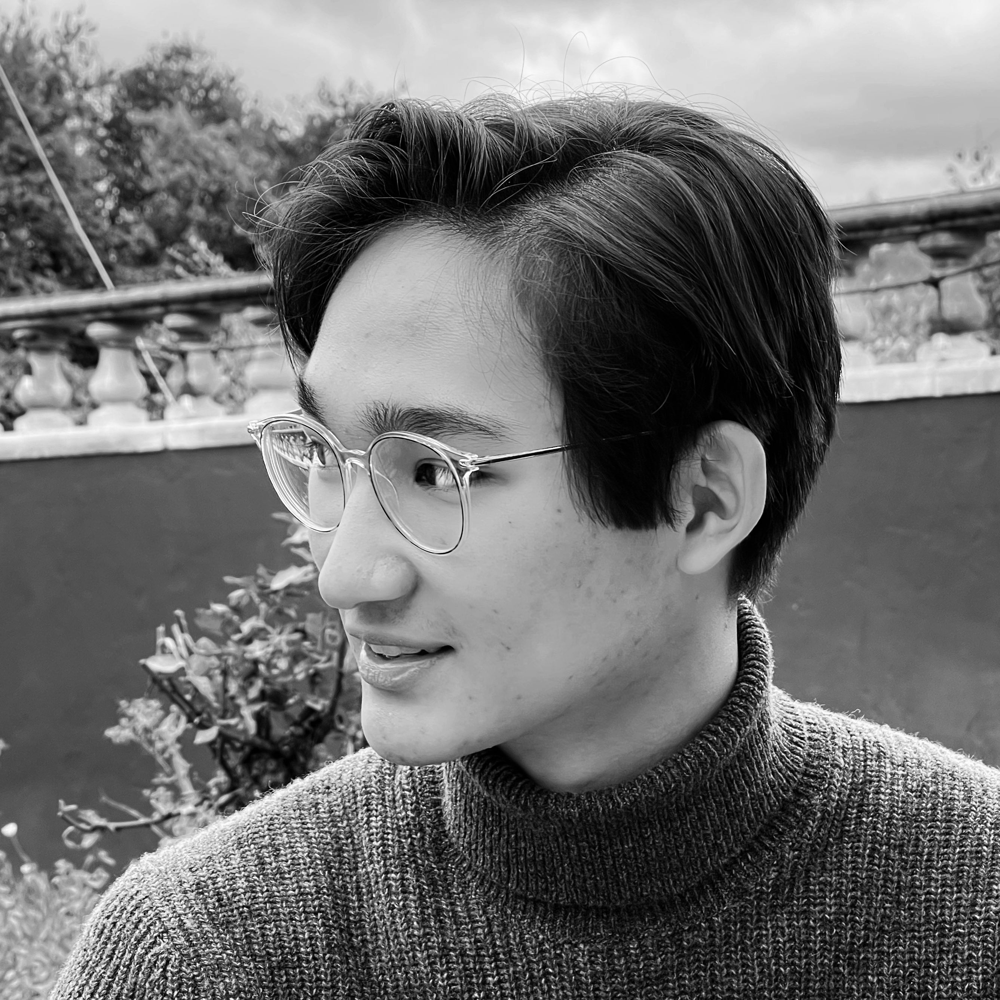

---
---

**Hello! I'm Marc. I'm currently a student at Northeastern University, studying Computer Science in the Artificial Intelligence track.**

I am pursuing quantum computing and machine learning. In the past, I have been heavily involved in full stack web and mobile development. 
These days I am more interested in quantum computing, artificial intelligence, back-end development, and data science/ML.

I love startups, case competitions, hip hop dance, jazz, playing the saxophone, photography, learning new things, and using what I learn to help others.

## Currently

- 🔎 Venture analyst at Northeastern's [IDEA Venture Accelerator](https://www.northeastern.edu/idea/)
- 📚 Attending classes at Northeastern University
- ✨ [Learning](/learning) something new and exciting every day
- 👨‍💻 Searching for a co-op position for Summer 2021, particularly in the artificial intelligence, deep learning, or quantum computing field. I'm open to both research and industry co-ops. Here is a copy of my [resume](/assets/Marc%20Bacvanski%20Resume.pdf).

## Recently

- ⚛️ Completed [CS-191x: Quantum Mechanics and Quantum Computation](https://courses.edx.org/certificates/18fb330fda7e47ec834dafaa682a5a0b), a course from UC BerkeleyX taught by Prof. Umesh Vazirani. Topics included the Quantum Fourier Transform, Grover's algorithm, Shor's algorithm, Hamiltonians, Schrödinger's equation, and manipulating physical spin qubits.
- 🧠 Completed a [specialization in deep learning](https://www.coursera.org/account/accomplishments/specialization/UW7XJ2WBD4A2), where I learned how to build and apply deep neural networks, CNNs, RNNs, and sequence models. 
- 🌐 Received a [certificate](/assets/QGSS_QuantumExcellenceCertificate.pdf) from IBM's Qiskit [Global Summer School](https://qiskit.org/events/summer-school/)! I learned to use Qiskit to run quantum algorithms on real quantum hardware.
- 🔥 Created an interactive [vibe alignment chart for Boston](/blog/vibe-of-boston)
- 👨‍💻 Lead software developer at [Deuce Technologies](https://deuce.technology/)
- 🏙 Founder and lead organizer of the [MVHacks Hackathon](https://mvhacks.io/)

## Let's Connect!

Feel free to reach out to me on [LinkedIn](https://linkedin.com/in/mbacvanski), 
[Github](https://github.com/mbacvanski), [Keybase](https://keybase.io/mbacvanski/chat), via [email](mailto:marc.bacvanski@gmail.com), or on various Slack groups.
I am always happy to chat technology, startups, or anything else.

